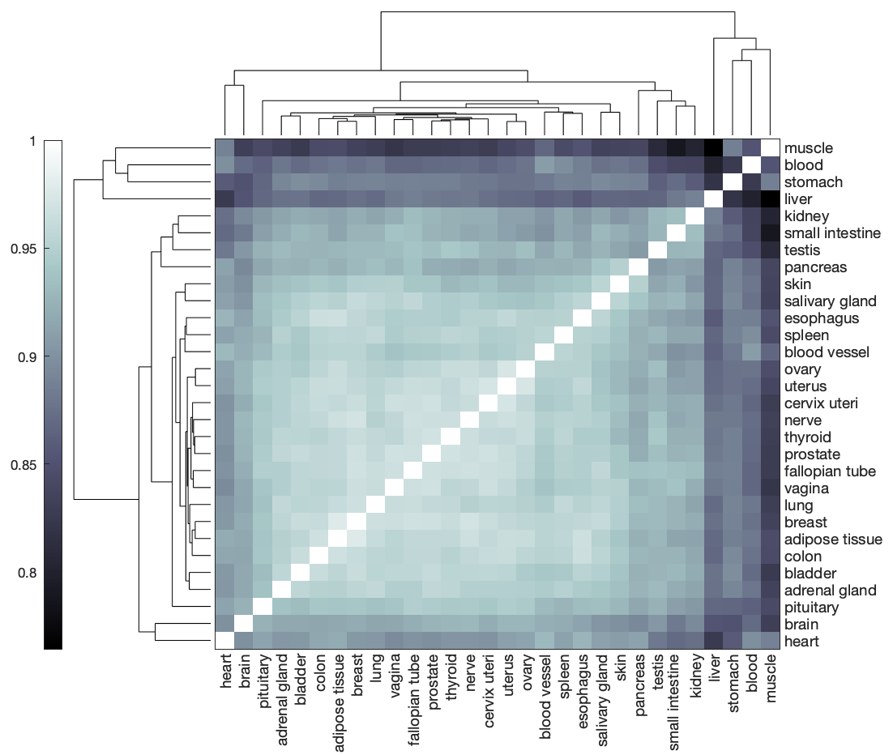
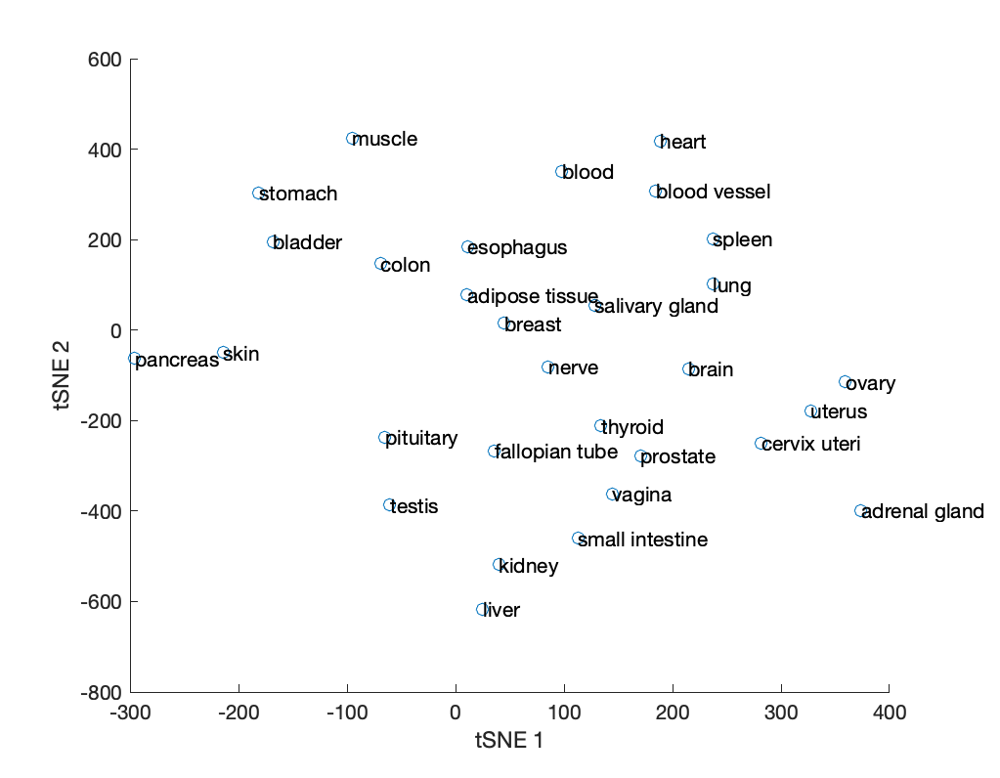
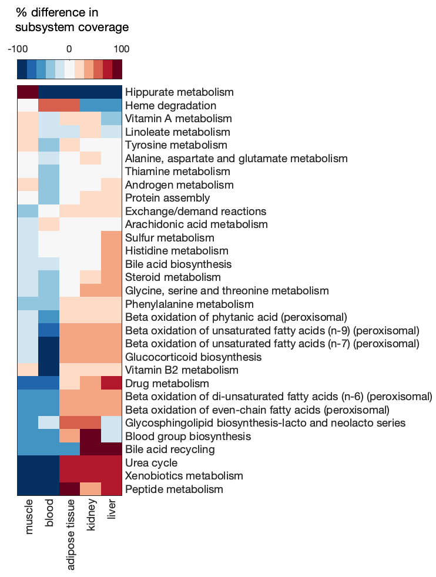
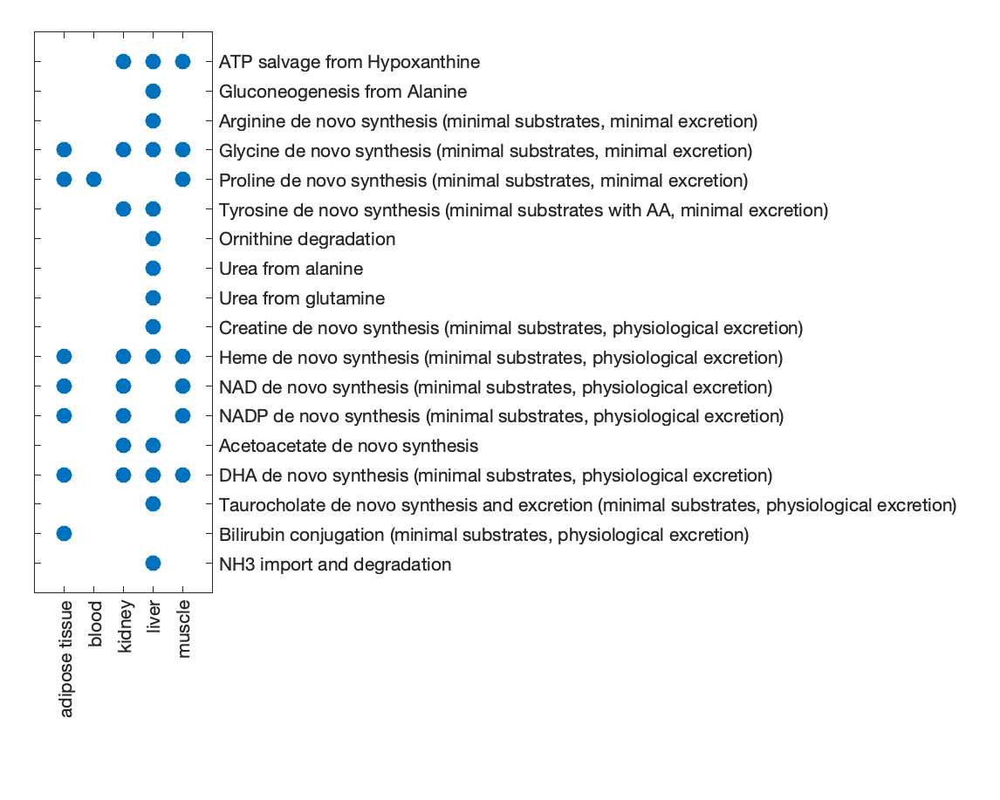

# Structural and functional comparison of GEMs

A useful approach in comparing the metabolic network of different tissues or cell types is to compare their corresponding GEMs. There are many ways in which the structure and function of different GEMs can be compared, but this guide will focus on an approach similar to that employed in the Human-GEM [publication](https://doi.org/10.1126/scisignal.aaz1482).

!!! important
	The model comparison approach presented here only applies to GEMs that were extracted from the same reference GEM, such that they share the same namespace (i.e., same reaction, metabolite, and gene ID types). 


## Prepare the GEMs

To demonstrate some model comparison methods, we will present an example based on the Human-GEM publication. The data and GEMs can be retrieved from the [Zenodo repository](https://doi.org/10.5281/zenodo.3577466) associated with the publication. 

Load the `.mat` file containing the tissue-specific GEMs that were extracted using GTEx RNA-Seq profiles.
```matlab
% replace '/my/path/' with the actual path on your machine
load('/my/path/tINIT_GEMs/run_tINIT_outputs/GTEx/tINIT_GTEx_outputs.mat');
```

The `tINIT_GTEx_outputs.mat` will be loaded as a structure named `INIT_output`.
```matlab
INIT_output

% INIT_output = 
% 
%   struct with fields:
% 
%        id: {30×1 cell}
%     model: {30×1 cell}
```

!!! note
	A cell array of models such as the one in the `model` field of the `INIT_output` structure be generated by `models = {liverGEM; lungGEM; kidneyGEM; ... };`, where each GEM is a separate extracted model to be compared.

Extract the fields as separate variables.
```matlab
model_ids = INIT_output.id;
models = INIT_output.model;
```

For convenience, the model ID for each GEM was extracted and saved as a cell array in the `id` field of the `INIT_output` structure. However, this can be regenerated from the model array:
```matlab
model_ids = arrayfun(@(i) models{i}.id, (1:numel(models))', 'UniformOutput', false);
```


## Compare GEM structures
The RAVEN `compareMultipleModels` function can be used to compare some basic features of different models such as reaction content and subsystem coverage.

Call the comparison function with the model array `models` as input.
```matlab
res = compareMultipleModels(models);

%  Getting model IDs 
% *** Done 
% 
% 
%  Comparing subsystem utilization 
% *** Done 
% 
% 
%  Comparing model reaction correlations 
% *** Done 
% 
% 
%  Comparing model reaction structures 
% *** Done
```

Take a look at the contents of the results structure `res`.
```matlab
res

% res = 
% 
%   struct with fields:
% 
%          modelIDs: {30×1 cell}
%        subsystems: [1×1 struct]
%         reactions: [1×1 struct]
%        structComp: [30×30 double]
%     structCompMap: [30×3 double]
```

Detail on the meaning of each output can be found in the `compareMultipleModels` function description (view using `help compareMultipleModels`), but a brief overview is provided here:

| Field         | Subfield&nbsp;&nbsp;&nbsp;&nbsp; | Description |
|:------------- |:-------- |:----------- |
| modelIDs      | --       | List of GEM IDs |
| subsystems    | ID       | List of subsystem IDs corresponding to rows in matrix subfield |
|               | matrix   | Number of reactions in each subsystem for each GEM |
| reactions     | IDs      | List of reaction IDs corresponding to rows in matrix subfield |
|               | matrix   | Binary matrix denoting presence (1) or absence (0) of each reaction in each GEM |
| structComp    | --       | Hamming similarity of reaction content between each pair of GEMs |
| structCompMap&nbsp;&nbsp; | --       | Reduced dimension (tSNE) mapping of GEMs based on the Hamming distances of their reaction content |

<br/>

The `compareMultipleModels` function represents the reaction content of each GEM as a binary vector (missing reactions are 0, present reactions are 1) to enable the use of quantitative comparison metrics, such as Hamming distance. GEMs that share fewer reactions will be separated by a larger Hamming distance, whereas GEMs that contain many of the same reactions will exhibit a small Hamming distance.

Visualize the reaction content Hamming similarity (1 - Hamming distance) among the GEMs using a clustergram.
```matlab
clustergram(res.structComp, 'Symmetric', false, 'Colormap', 'bone', 'RowLabels', res.modelIDs, 'ColumnLabels', res.modelIDs);
```
{: style="width:95%"}

!!! note
	Given the generally poor plotting capabilities and limited color palette options in MATLAB, an option is to export the `res.structComp` matrix and/or other results to a csv or text file and import them into R, python, or some other package with more plotting flexibility.


The `structCompMap` field of the model comparison results structure contains a mapping of the GEMs' binary reaction vectors in reduced (3) dimensions using tSNE. Since 3D plots can be difficult to interpret, we can regenerate the mapping in 2 dimensions.
```matlab
rxn2Dmap = tsne(res.reactions.matrix', 'Distance', 'hamming', 'NumDimensions', 2, 'Perplexity', 5);

% plot and label the GEMs in tSNE space
scatter(rxn2Dmap(:,1), rxn2Dmap(:,2));
hold on
text(rxn2Dmap(:,1), rxn2Dmap(:,2), res.modelIDs);
``` 
{: style="width:85%"}


The Hamming distance heatmap and tSNE projection give an overall picture of how similar or different models are from one another, but it does not resolve the cause or biological meaning of those differences. A convenient source of biological context is the `subSystems` field in the model, which describes the metabolic subsystem or pathway to which reactions belong. We can therefore look at differences in reaction content in each of these subsystems to see which parts of metabolism differ most among the GEMs.

To simplify the interpretation of results, select a subset of GEMs to analyze further.
```matlab
useModels = {'adipose tissue', 'blood', 'kidney', 'liver', 'muscle'};
keep = ismember(res.modelIDs, useModels);
subMat = res.subsystems.matrix(:, keep);
```

Calculate the percent difference of GEM subsystem coverage (number of reactions in the subsystem) from the mean coverage.
```matlab
subCoverage = (subMat - mean(subMat, 2)) ./ mean(subMat, 2) * 100;
```

Visualize the difference in subsystem coverage with a clustergram, including only subsystems with at least a 25% difference in one or more GEMs.
```matlab
% select subsystems to include in plot
inclSub = any(abs(subCoverage) > 25, 2);
subNames = res.subsystems.ID(inclSub);

% generate clustergram
cg = clustergram(subCoverage(inclSub,:), 'Colormap', redbluecmap, 'DisplayRange', 100, 'rowLabels', subNames, 'columnLabels', useModels, 'ShowDendrogram', 'OFF');
```
{: style="width:60%"}

!!! tip
	The `clustergram` function is very limited in how the produced heatmap can be modified. After running the `cg = clustergram(...)` command, close the figure and use `plot(cg)` to render a new version of the heatmap that has more editing options.


## Compare GEM functions
In addition to GEM structure, the functionality of GEMs can be compared to provide insight into differences in their metabolic activity. One way in which the function of a GEM can be assessed is by evaluating its ability to perform different metabolic tasks.

The GTEx tissue GEMs used in this example were generated using tINIT with a list of 57 essential tasks (see the [GEM extraction](gem_extraction.md) section of this guide for details). Therefore, comparing the GEMs' ability to complete these 57 tasks would be highly uninteresting because they were all generated with the requirement that these tasks are functional. For a more interesting comparison, we will instead use a different list of 256 metabolic tasks.

To speed up the calculation and to narrow the focus, we will include only a few of the GEMs in this comparison.
```matlab
useModels = {'adipose tissue', 'blood', 'kidney', 'liver', 'muscle'};
keep = ismember(res.modelIDs, useModels);
```

The larger metabolic task file `metabolicTasks_Full.xlsx` can be found in the `/data/metabolicTasks/` subdirectory of the Human-GEM repository.
```matlab
% replace '/my/path/' with the actual path on your machine
taskFileName = '/my/path/Human-GEM/data/metabolicTasks/metabolicTasks_Full.xlsx';
```

Re-run the `compareMultipleModels` function, now including the location of the metabolic task file.
```matlab
res_func = compareMultipleModels(models(keep), false, false, [], true, taskFile);

%  Getting model IDs 
% *** Done 
% 
% 
%  Comparing subsystem utilization 
% *** Done 
% 
% 
%  Comparing model reaction correlations 
% *** Done 
% 
% 
%  Comparing model reaction structures 
% *** Done 
% 
% 
%  Checking model performance on specified tasks. 
% 
%  Checking model # 1 
% ERROR: Could not find all inputs in "[71] Cystine de novo synthesis (minimal substrates, minimal excretion)"
% 
%  Checking model # 2 
% ERROR: Could not find all inputs in "[71] Cystine de novo synthesis (minimal substrates, minimal excretion)"
% ERROR: Could not find all outputs in "[103] Heme de novo synthesis (minimal substrates, physiological excretion)"
% ERROR: Could not find all inputs in "[249] Bilirubin conjugation (minimal substrates, physiological excretion)"
% 
%  Checking model # 3 
% ERROR: Could not find all inputs in "[71] Cystine de novo synthesis (minimal substrates, minimal excretion)"
% 
%  Checking model # 4 
% ERROR: Could not find all inputs in "[71] Cystine de novo synthesis (minimal substrates, minimal excretion)"
% 
%  Checking model # 5 
% ERROR: Could not find all inputs in "[71] Cystine de novo synthesis (minimal substrates, minimal excretion)"
% ERROR: Could not find all inputs in "[249] Bilirubin conjugation (minimal substrates, physiological excretion)"
% *** Done 
```

!!! note
	The ERROR messages here are not actual errors, but indicate that a task was failed because the GEM was missing one or more metabolites involved in the test.


The results structure will now have an additional `funcComp` field.
```matlab
res_func.funcComp

% ans = 
% 
%   struct with fields:
% 
%     matrix: [256×5 double]
%      tasks: {256×1 cell}
```

The `matrix` subfield is a binary matrix indicating whether each task passed (1) or failed (0) in each GEM, and the `tasks` subfield contains the name of the evaluated tasks.

Identify which tasks differed among the GEMs (i.e., not all passed or all failed).
```matlab
isDiff = ~all(res_func.funcComp.matrix == 0, 2) & ~all(res_func.funcComp.matrix == 1, 2);
diffTasks = res_func.funcComp.tasks(isDiff)

% diffTasks =
% 
%   18×1 cell array
% 
%     {'ATP salvage from Hypoxanthine'                                                             }
%     {'Gluconeogenesis from Alanine'                                                              }
%     {'Arginine de novo synthesis (minimal substrates, minimal excretion)'                        }
%     {'Glycine de novo synthesis (minimal substrates, minimal excretion)'                         }
%     {'Proline de novo synthesis (minimal substrates, minimal excretion)'                         }
%     {'Tyrosine de novo synthesis (minimal substrates with AA, minimal excretion)'                }
%     {'Ornithine degradation'                                                                     }
%     {'Urea from alanine'                                                                         }
%     {'Urea from glutamine'                                                                       }
%     {'Creatine de novo synthesis (minimal substrates, physiological excretion)'                  }
%     {'Heme de novo synthesis (minimal substrates, physiological excretion)'                      }
%     {'NAD de novo synthesis (minimal substrates, physiological excretion)'                       }
%     {'NADP de novo synthesis (minimal substrates, physiological excretion)'                      }
%     {'Acetoacetate de novo synthesis'                                                            }
%     {'DHA de novo synthesis (minimal substrates, physiological excretion)'                       }
%     {'Taurocholate de novo synthesis and excretion (minimal substrates, physiological excretion)'}
%     {'Bilirubin conjugation (minimal substrates, physiological excretion)'                       }
%     {'NH3 import and degradation'                                                                }
```

Generate a scatter plot to visualize GEM performance on the subset of tasks that differed.
```matlab
% visualize the matrix
spy(res_func.funcComp.matrix(isDiff,:), 30);

% apply some formatting changes
set(gca, 'XTick', 1:numel(useModels), 'XTickLabel', useModels, 'XTickLabelRotation', 90, ...
    'YTick', 1:numel(diffTasks), 'YTickLabel', diffTasks, 'YAxisLocation', 'right');
xlabel(gca, '');
```
{: style="width:90%"}


