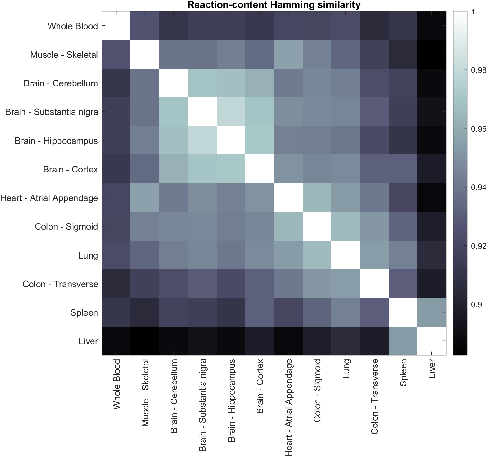
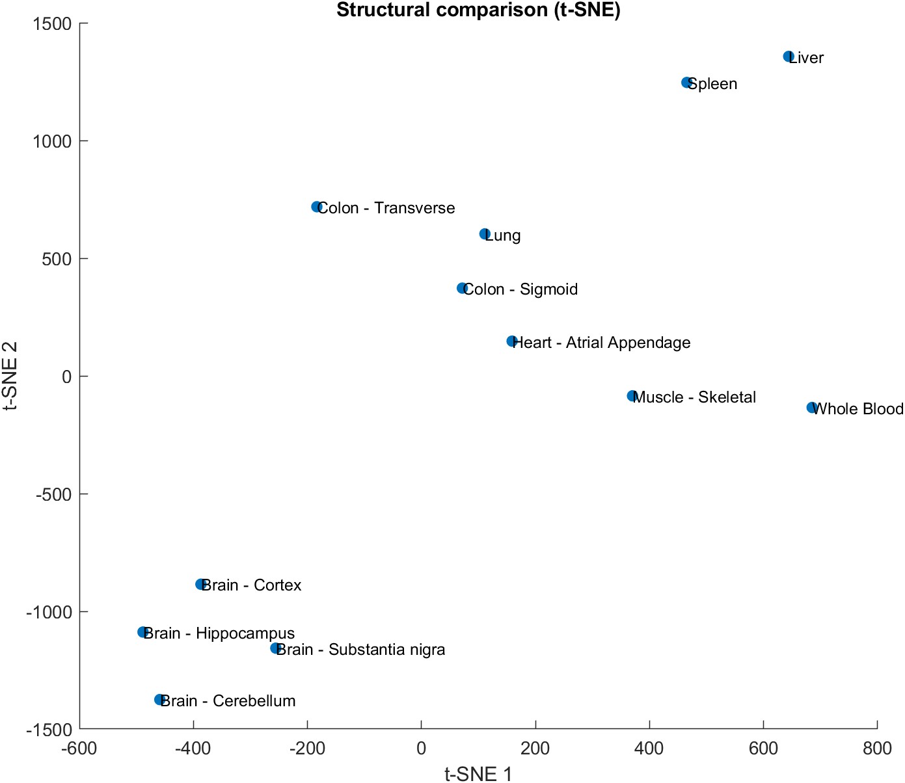
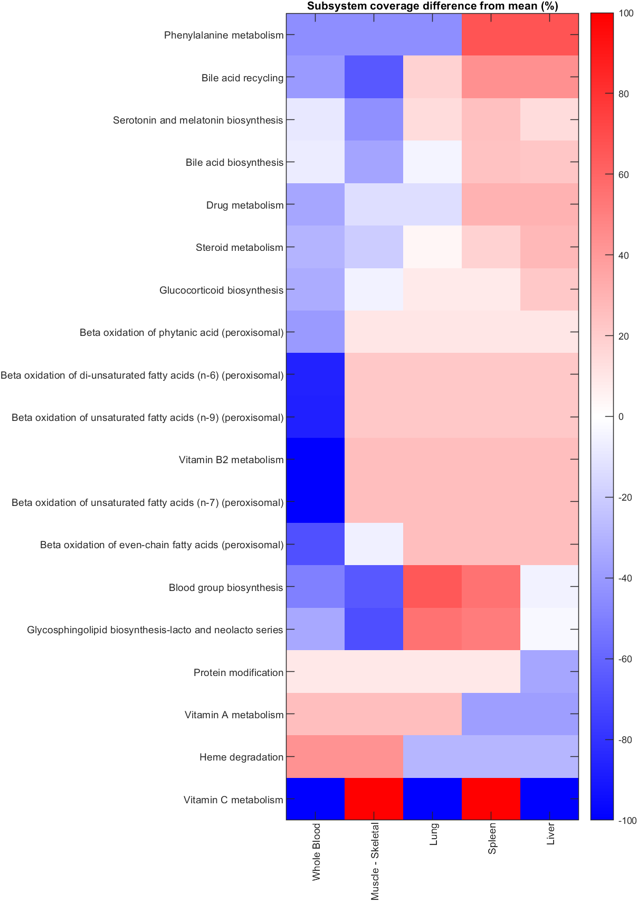

# Structural and functional comparison of GEMs

A useful approach in comparing the metabolic network of different tissues or cell types is to compare their corresponding GEMs. There are many ways in which the structure and function of different GEMs can be compared, but this guide will focus on an approach similar to that employed in the Human-GEM [publication](https://doi.org/10.1126/scisignal.aaz1482).

!!! important
	The model comparison approach presented here only applies to GEMs that were extracted from the same reference GEM, such that they share the same namespace (i.e., same reaction, metabolite, and gene ID types).


## Prepare the GEMs

To demonstrate the comparison methods, we use tissue-specific GEMs extracted from the GTEx tutorial data. For each of the 12 tissues in the dataset, the five samples were averaged and a model was extracted with ftINIT (`'1+0'`), as described in the [GEM extraction](gem_extraction.md) section. This produces a cell array `models` of 12 tissue GEMs, each with its `id` set to the tissue name.

```matlab
load('tissueModels.mat');   % a cell array "models" of 12 tissue GEMs
```

!!! note
	A cell array of models such as `models` can be generated by `models = {liverGEM; lungGEM; kidneyGEM; ... };`, where each GEM is a separate extracted model to be compared. Setting a descriptive `models{i}.id` (e.g., the tissue name) makes the comparison plots easier to read.


## Compare GEM structures
The RAVEN `compareMultipleModels` function can be used to compare some basic features of different models such as reaction content and subsystem coverage.

Call the comparison function with the model array `models` as input.
```matlab
res = compareMultipleModels(models);

%  Getting model IDs 
% *** Done 
% 
%  Comparing subsystem utilization 
% *** Done 
% 
%  Comparing model reaction correlations 
% *** Done 
% 
%  Comparing model reaction structures 
% *** Done
```

Take a look at the contents of the results structure `res`.
```matlab
res

% res = 
% 
%   struct with fields:
% 
%          modelIDs: {12×1 cell}
%        subsystems: [1×1 struct]
%         reactions: [1×1 struct]
%        structComp: [12×12 double]
%     structCompMap: [12×3 double]
```

Detail on the meaning of each output can be found in the `compareMultipleModels` function description (view using `help compareMultipleModels`), but a brief overview is provided here:

| Field         | Subfield&nbsp;&nbsp;&nbsp;&nbsp; | Description |
|:------------- |:-------- |:----------- |
| modelIDs      | --       | List of GEM IDs |
| subsystems    | ID       | List of subsystem IDs corresponding to rows in matrix subfield |
|               | matrix   | Number of reactions in each subsystem for each GEM |
| reactions     | IDs      | List of reaction IDs corresponding to rows in matrix subfield |
|               | matrix   | Binary matrix denoting presence (1) or absence (0) of each reaction in each GEM |
| structComp    | --       | Hamming similarity of reaction content between each pair of GEMs |
| structCompMap&nbsp;&nbsp; | --       | Reduced dimension (tSNE) mapping of GEMs based on the Hamming distances of their reaction content |

<br/>

The `compareMultipleModels` function represents the reaction content of each GEM as a binary vector (missing reactions are 0, present reactions are 1) to enable the use of quantitative comparison metrics, such as Hamming distance. GEMs that share fewer reactions will be separated by a larger Hamming distance, whereas GEMs that contain many of the same reactions will exhibit a small Hamming distance.

Visualize the reaction content Hamming similarity (1 - Hamming distance) among the GEMs as a heatmap. The Human-GEM publication used the `clustergram` function, but that requires the MATLAB Bioinformatics Toolbox. The code below instead uses `imagesc` together with hierarchical clustering from the Statistics and Machine Learning Toolbox (`linkage`, `optimalleaforder`), so no Bioinformatics Toolbox is needed.
```matlab
% order the models by clustering their reaction-content distances
D = 1 - res.structComp;             % Hamming distance
D = (D + D')/2;                     % enforce symmetry
D(1:size(D,1)+1:end) = 0;           % zero diagonal
order = optimalleaforder(linkage(squareform(D), 'average'), squareform(D));

% plot the (reordered) similarity matrix
figure;
imagesc(res.structComp(order, order));
colormap(bone); colorbar; axis square;
set(gca, 'XTick', 1:numel(res.modelIDs), 'XTickLabel', res.modelIDs(order), 'XTickLabelRotation', 90, ...
         'YTick', 1:numel(res.modelIDs), 'YTickLabel', res.modelIDs(order), 'TickLabelInterpreter', 'none');
title('Reaction-content Hamming similarity');
```
{: style="width:80%"}

!!! note
	Given the generally limited plotting flexibility in MATLAB, another option is to export the `res.structComp` matrix and/or other results to a csv or text file and import them into R, python, or another package with more plotting flexibility.


The `structCompMap` field of the model comparison results structure contains a mapping of the GEMs' binary reaction vectors in reduced (3) dimensions using tSNE. Since 3D plots can be difficult to interpret, we can regenerate the mapping in 2 dimensions.
```matlab
rng(1);  % set random seed to make reproducible
rxn2Dmap = tsne(res.reactions.matrix', 'Distance', 'hamming', 'NumDimensions', 2, 'Perplexity', 3);

% plot and label the GEMs in tSNE space
figure;
scatter(rxn2Dmap(:,1), rxn2Dmap(:,2), 40, 'filled');
hold on
text(rxn2Dmap(:,1), rxn2Dmap(:,2), res.modelIDs, 'Interpreter', 'none');
``` 
{: style="width:80%"}


The Hamming distance heatmap and tSNE projection give an overall picture of how similar or different models are from one another, but they do not resolve the cause or biological meaning of those differences. A convenient source of biological context is the `subSystems` field in the model, which describes the metabolic subsystem or pathway to which reactions belong. We can therefore look at differences in reaction content in each of these subsystems to see which parts of metabolism differ most among the GEMs.

To simplify the interpretation of results, select a subset of GEMs to analyze further.
```matlab
useModels = {'Liver', 'Lung', 'Muscle - Skeletal', 'Spleen', 'Whole Blood'};
keep = ismember(res.modelIDs, useModels);
subMat = res.subsystems.matrix(:, keep);
```

Calculate the percent difference of GEM subsystem coverage (number of reactions in the subsystem) from the mean coverage.
```matlab
subCoverage = (subMat - mean(subMat, 2)) ./ mean(subMat, 2) * 100;
```

Visualize the difference in subsystem coverage as a heatmap, including only subsystems with at least a 25% difference in one or more GEMs. Again we avoid `clustergram`, clustering the rows with `linkage`/`optimalleaforder` and building a blue-white-red diverging colormap by hand.
```matlab
% select subsystems to include in the plot
inclSub  = any(abs(subCoverage) > 25, 2);
M        = subCoverage(inclSub, :);
subNames = res.subsystems.ID(inclSub);

% blue-white-red diverging colormap (no Bioinformatics Toolbox required)
half = 128;
rwb = [ [linspace(0,1,half) ones(1,half)]', ...
        [linspace(0,1,half) linspace(1,0,half)]', ...
        [ones(1,half) linspace(1,0,half)]' ];

% cluster the rows (subsystems) and plot
rowOrder = optimalleaforder(linkage(M, 'average', 'euclidean'), pdist(M));
figure;
imagesc(M(rowOrder, :), [-100 100]);
colormap(rwb); colorbar;
set(gca, 'XTick', 1:sum(keep), 'XTickLabel', res.modelIDs(keep), 'XTickLabelRotation', 90, ...
         'YTick', 1:numel(subNames), 'YTickLabel', subNames(rowOrder), 'TickLabelInterpreter', 'none');
title('Subsystem coverage difference from mean (%)');
```
{: style="width:60%"}


## Compare GEM functions
In addition to GEM structure, the functionality of GEMs can be compared to provide insight into differences in their metabolic activity. One way in which the function of a GEM can be assessed is by evaluating its ability to perform different metabolic tasks.

The tissue GEMs used in this example were generated with the list of 57 essential tasks (see the [GEM extraction](gem_extraction.md) section of this guide for details). Therefore, comparing the GEMs' ability to complete these 57 tasks would be highly uninteresting because they were all generated with the requirement that these tasks are functional. For a more interesting comparison, we will instead use the larger list of metabolic tasks.

To speed up the calculation and to narrow the focus, we will include only a few of the GEMs in this comparison (the same subset as above).
```matlab
useModels = {'Liver', 'Lung', 'Muscle - Skeletal', 'Spleen', 'Whole Blood'};
keep = ismember(res.modelIDs, useModels);
```

The larger metabolic task file `metabolicTasks_Full.txt` can be found in the `/data/metabolicTasks/` subdirectory of the Human-GEM repository.
```matlab
% replace '/my/path/' with the actual path on your machine
taskFile = '/my/path/Human-GEM/data/metabolicTasks/metabolicTasks_Full.txt';
```

Re-run the `compareMultipleModels` function, now including the location of the metabolic task file.
```matlab
res_func = compareMultipleModels(models(keep), false, false, [], true, taskFile);
```

!!! note
	During the task check, RAVEN prints `ERROR` messages for tasks that a GEM cannot complete (e.g., "Could not find all inputs ..."). These are not actual errors, but indicate that a task failed because the GEM was missing one or more metabolites involved in the test.


The results structure will now have an additional `funcComp` field.
```matlab
res_func.funcComp

% ans = 
% 
%   struct with fields:
% 
%     matrix: [257×5 double]
%      tasks: {257×1 cell}
```

The `matrix` subfield is a binary matrix indicating whether each task passed (1) or failed (0) in each GEM, and the `tasks` subfield contains the name of the evaluated tasks.

Identify which tasks differed among the GEMs (i.e., not all passed or all failed).
```matlab
isDiff = ~all(res_func.funcComp.matrix == 0, 2) & ~all(res_func.funcComp.matrix == 1, 2);
diffTasks = res_func.funcComp.tasks(isDiff)

% diffTasks =
% 
%   0×1 empty cell array
```

In this example, none of the 257 tasks differed among the five tissue GEMs — each task was either performed by all of them or by none of them, so `diffTasks` is empty. This is a consequence of the `'1+0'` ftINIT setup used to generate the models, which retains most reactions that lack gene rules and therefore yields relatively complete models with shared task capabilities.

To reveal finer functional differences between tissues, generate the models with a more stringent extraction — for example the `'1+1'` setup, which removes more reactions — or use the tINIT models from the Human-GEM [publication](https://doi.org/10.1126/scisignal.aaz1482). When tasks do differ, the difference can be visualized with a `spy` plot of the tasks that vary:
```matlab
figure;
spy(res_func.funcComp.matrix(isDiff,:), 30);
set(gca, 'XTick', 1:numel(useModels), 'XTickLabel', res.modelIDs(keep), 'XTickLabelRotation', 90, ...
    'YTick', 1:numel(diffTasks), 'YTickLabel', diffTasks, 'YAxisLocation', 'right', 'TickLabelInterpreter', 'none');
xlabel(gca, '');
```
