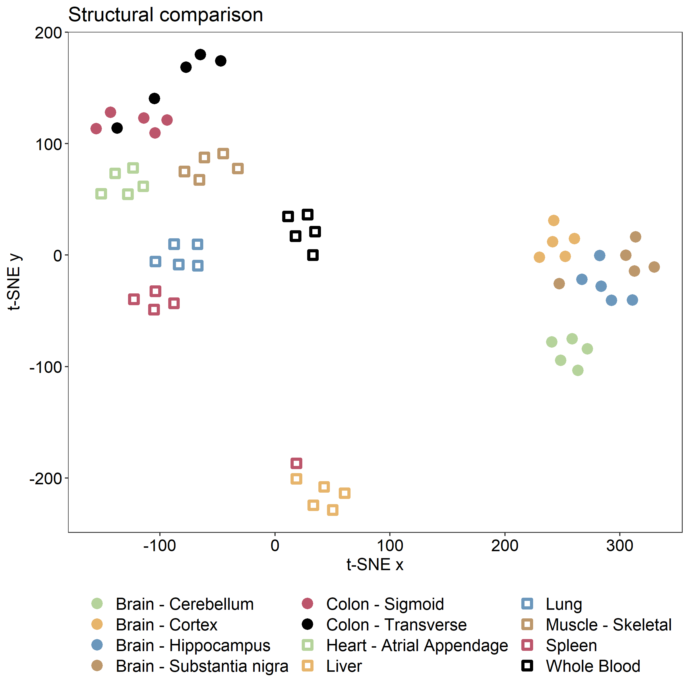

# GEM Extraction

Human-GEM is a generic model of human metabolism, meaning that it contains metabolic reactions known to occur in any human cell. The model is therefore not representative of any one tissue or cell type, in which only a subset of the reactions would be active.

A common approach is to extract the subset of the GEM that is likely to be active in the tissue or cell type of interest, based on a corresponding dataset (e.g., transcriptomics, proteomics, metabolomics, etc.). This approach is often referred to as *GEM extraction* or *contextualization*, where the generated model is termed the *extracted* or *contextualized*/*context-specific GEM*.


## Fast Task‐driven Integrative Network Inference for Tissues (ftINIT)

Although many GEM extraction methods exist, this guide will cover the ftINIT algorithm. For more details on the algorithm, see the following papers:

1. [Agren *et al.* (2012) *PLoS Comput Biol*](https://doi.org/10.1371/journal.pcbi.1002518) - Initial development of INIT
2. [Agren *et al.* (2014) *Mol Syst Biol*](https://doi.org/10.1002/msb.145122) - Incorporation of metabolic tasks (tINIT)
3. [Robinson *et al.* (2020) *Sci Signal*](https://doi.org/10.1126/scisignal.aaz1482) - Recognition of enzyme complexes
4. [Gustafsson *et al.* (2022) *PNAS*](https://doi.org/10.1073/pnas.2217868120) - ftINIT, faster and produces less gaps in the models

The ftINIT algorithm is available in the RAVEN Toolbox, and we use it together with help functions for Human-GEM available in the Human-GEM repository.

To support users of the previous algorithm (tINIT), we also include a [guide](gem_extraction_old_tINIT.md) for the previous (2020) version of tINIT, called the `getINITModel2` function.

## Retrieve the data

To demonstrate the use of ftINIT, we will walk through an example where we generate models from GTEx data. For simplicity, we extracted 60 RNA-Seq profiles from in total 12 tissues. The data can be downloaded [here](https://doi.org/10.5281/zenodo.6811073)  together with other data useful for this tutorial. 

Download the Zenodo repository .zip file, and extract.

## Load and prepare the reference model for use with ftINIT

The reference GEM from which the tissue-specific models will be extracted is Human-GEM. Load the model from the `Human-GEM.mat` file in the Human-GEM repository

```matlab
load('Human-GEM.mat');  % loads model as a structure named "ihuman"
```

ftINIT has a preparation step that needs to be run once for a reference model such as Human-GEM. The purpose of the preparation step is to make calculations in advance to reduce the time it takes to generate each context-specific model. The result is a prepData structure that contains various information needed by ftINIT. This operation takes 1-2 hours on a standard laptop computer, so make sure to save it once it has completed. For version 1.12.0 of Human-GEM, the prepData is available in the Zenodo .zip file.

```matlab
% The second flag indicates if the model should be converted to gene symbols from ENSEMBL. This has to be decided at this point.
% Replace path/to/HumanGEM with your local path to the Human-GEM repo root.
% For use with animal models derived from Human-GEM, such as Mouse-GEM, both the model and paths needs to be replaced. Also, 
% the convert genes flag may be irrelevant depending on the if ENSEMBL genes are used in that model.
prepData = prepHumanModelForftINIT(ihuman, false, 'path/to/HumanGEM/data/metabolicTasks/metabolicTasks_Essential.txt', 'path/to/HumanGEM/model/reactions.tsv');
save('prepData.mat', 'prepData')
```

`prepHumanModelForftINIT` tests that the reference model (Human-GEM) can successfully perform all essential metabolic tasks (defined in `data/metabolicTasks/metabolicTasks_Essential.txt`), which is an important step. If the reference model cannot perform a task, then neither can any GEM extracted from that model.


!!! note
    The exchange reactions should all be unbounded (e.g., lower and upper bounds of -1000 and 1000, respectively). Human-GEM is already provided in this format, so no additional changes are needed.

!!! note
    The function `prepHumanModelForftINIT` will automatically use the essential tasks from `metabolicTasks_Essential.txt` in the Human-GEM repository. To specify different metabolic tasks, use `prepINITModel` in RAVEN directly instead.


## Prepare the transcriptomic data

Data from the condition, tissue, or cell type for which the GEM will be generated is necessary to determine which reactions from the reference model (Human-GEM) should be included. In this case, we use a file with tissues extracted from the GTEx database, which is available in the Zenodo .zip file.

In MATLAB, load the `gtexSampForTutorialTPM.txt` file from the Zenodo repository.

```matlab
% replace 'my/path/' with the path on your system, or change to the directory containing the file
gtex_data = readtable('my/path/gtexSampForTutorialTPM.txt');
[~, n] = size(gtex_data);
numSamp = n-2; %the first two columns are the genes in ENSEMBL and gene symbols format

% take a look at the first few rows and columns of the table
gtex_data(1:5, 1:5)
% ans =
% 
%   5×5 table
% 
%            Name              Description      GTEX_111YS_0006_SM_5NQBE    GTEX_1122O_0005_SM_5O99J    GTEX_1128S_0005_SM_5P9HI
%     ___________________    _______________    ________________________    ________________________    ________________________
% 
%     {'ENSG00000223972'}    {'DDX11L1'    }            0.02171                     0.03015                      0.0203         
%     {'ENSG00000227232'}    {'WASH7P'     }              1.555                       2.747                       4.441         
%     {'ENSG00000278267'}    {'MIR6859-1'  }                  0                           0                           0         
%     {'ENSG00000243485'}    {'MIR1302-2HG'}                  0                           0                           0         
%     {'ENSG00000237613'}    {'FAM138A'    }                  0                           0                      0.0576         
```

Extract information from the table into a structure called `data_struct`
```matlab
% extract the tissue and gene names
data_struct.genes = gtex_data{:, 1}; % gene names
data_struct.tissues = gtex_data.Properties.VariableNames(3:n); % sample (tissue) names
data_struct.levels = gtex_data{:, 3:n}; % gene TPM values
```

!!! important
	The name of the data structure (`data_struct` in this example) is not important. However, its fields (`genes`, `tissues`, `levels`) should **not** be changed.

Although the original tINIT implementation always compared gene expression in the tissue of interest to the average of all other provided tissues, ftINIT enables the option to instead compare the expression to a threshold value. Here, we will use this alternative approach with a threshold value of 1 TPM.
```matlab
data_struct.threshold = 1;
```

!!! note
	Exclude the `threshold` field from the data structure to use the original tINIT approach of comparing the gene expression in your tissue of interest with all other tissues. If you choose this approach, however, you _**must include the gene expression data from the other tissues**_ so that the algorithm has something to compare to.

Take a look at `data_struct` to make sure all the fields are present and have the expected dimensions
```matlab
data_struct

% data_struct =
%
%   struct with fields:
% 
%         genes: {56200×1 cell}
%       tissues: {1×60 cell}
%        levels: [56200×60 double]
%     threshold: 1
```

## Run ftINIT

Now all inputs are ready to run ftINIT and extract GEMs specific to the samples based on their corresponding RNA expression profile. ftINIT normally runs in two steps, of which the second is optional. The first step excludes most of the reactions without gene rules (GPRs) from the problem, and the second step determines which of those reactions should be removed. The second step can be omitted, which causes most reactions without GPRs to remain in the model. This is a good option in many cases, for example for structural comparison of models, since removal of reactions without GPRs does not provide any additional information and may add randomness in cases where there are several equally good solutions.

We first run ftINIT without the second step, a setup that is called `'1+0'`, which typically takes 30 - 60 seconds:

```matlab
model1 = ftINIT(prepData, data_struct.tissues{1}, [], [], data_struct, {}, getHumanGEMINITSteps('1+0'), false, true);

model1
% 
%   struct with fields:
% 
%                      id: 'Human-GEM'
%             description: 'Generic genome-scale metabolic model of Homo sapiens'
%                    rxns: {8407×1 cell}
%                    mets: {5613×1 cell}
%                       S: [5613×8407 double]
%                      lb: [8407×1 double]
%                      ub: [8407×1 double]
%                     rev: [8407×1 double]
%                       c: [8407×1 double]
%                       b: [5613×1 double]
%                   comps: {9×1 cell}
%               compNames: {9×1 cell}
%                rxnNames: {8407×1 cell}
%                 grRules: {8407×1 cell}
%              rxnGeneMat: [8407×2494 double]
%              subSystems: {8407×1 cell}
%                 eccodes: {8407×1 cell}
%                rxnNotes: {8407×1 cell}
%                   genes: {2494×1 cell}
%                metNames: {5613×1 cell}
%                metComps: [5613×1 double]
%                  inchis: {5613×1 cell}
%             metFormulas: {5613×1 cell}
%           rxnReferences: {8407×1 cell}
%                 rxnFrom: {8407×1 cell}
%                 metFrom: {5613×1 cell}
%     rxnConfidenceScores: [8407×1 double]
%              metCharges: [5613×1 int64]
%                 version: '1.12.0'
%              annotation: [1×1 struct]
```

As an alternative, we can run it with the second step included (`'1+1'`), which takes roughly 2 - 3 times as long and generates a smaller model:

```matlab
model2 = ftINIT(prepData, data_struct.tissues{1}, [], [], data_struct, {}, getHumanGEMINITSteps('1+1'), false, true);

model2
% 
%   struct with fields:
% 
%                      id: 'Human-GEM'
%             description: 'Generic genome-scale metabolic model of Homo sapiens'
%                    rxns: {7752×1 cell}
%                    mets: {5490×1 cell}
%                       S: [5490×7752 double]
%                      lb: [7752×1 double]
%                      ub: [7752×1 double]
%                     rev: [7752×1 double]
%                       c: [7752×1 double]
%                       b: [5490×1 double]
%                   comps: {9×1 cell}
%               compNames: {9×1 cell}
%                rxnNames: {7752×1 cell}
%                 grRules: {7752×1 cell}
%              rxnGeneMat: [7752×2494 double]
%              subSystems: {7752×1 cell}
%                 eccodes: {7752×1 cell}
%                rxnNotes: {7752×1 cell}
%                   genes: {2494×1 cell}
%                metNames: {5490×1 cell}
%                metComps: [5490×1 double]
%                  inchis: {5490×1 cell}
%             metFormulas: {5490×1 cell}
%           rxnReferences: {7752×1 cell}
%                 rxnFrom: {7752×1 cell}
%                 metFrom: {5490×1 cell}
%     rxnConfidenceScores: [7752×1 double]
%              metCharges: [5490×1 int64]
%                 version: '1.12.0'
%              annotation: [1×1 struct]
```

It is also possible to supply cell type for cases where tissues are subdivided into cell type, which is not the case here. The method also accepts proteomics data from Human Protein Atlas (HPA) and metabolomics data, but these are not demonstrated here.


!!! note
	The two steps used here are the two most common approaches to run ftINIT and are what we recommend, but they are not the only options. ftINIT can for example be run in a very similar way to the original tINIT algorithm by using the `'full'` setup.


It is recommended to change the model `id` to a more descriptive name than the default of "INITModel". This is particularly useful when analyzing several models together.
```matlab
model1.id = data_struct.tissues{1};
```

## Run ftINIT for all samples

We can now run ftINIT on all samples:

```matlab
models = cell(numSamp, 1);
for i = 1:numSamp
    disp(['Model: ' num2str(i) ' of ' num2str(numSamp)])
    models{i} = ftINIT(prepData, data_struct.tissues{i}, [], [], data_struct, {}, getHumanGEMINITSteps('1+0'), false, true);
end

save('models.mat', 'models')
```

!!! warning
	This loop generates 60 models, which will take a while to run (30 min to 1 hr). For running many models, it is therefore recommended that this is run on a compute cluster.

## Quick examination of the models

To get a quick structural overview of the models, we perform a t-SNE (t-Distributed Stochastic Neighbor Embedding) transformation of the models' reaction content and export that data to a file for visualization in R.

```matlab
baseModel = prepData.refModel;

% now build a matrix saying which reactions are on
compMat = false(length(baseModel.rxns), length(models));

for i = 1:size(compMat,2)
    compMat(:,i) = ismember(baseModel.rxns,models{i}.rxns);
end

% run t-sne
rng(1);  %set random seed to make reproducible
proj_coords = tsne(double(compMat.'), 'Distance', 'hamming', 'NumDimensions', 2, 'Exaggeration', 6, 'Perplexity', 10);

% export to R
d = struct();
d.tsneX = proj_coords(:, 1);
d.tsneY = proj_coords(:, 2);
save('TSNE.mat', 'd');
```

We can then visualize the data in R (use e.g., RStudio) using ggplot:

```R
library(R.matlab)
library(tidyverse)
library(ggplot2)

#import the data using R.matlab
setwd("my/path") #replace with your own path where the exported data was saved
tsneData = readMat("TSNE.mat")
x = as.numeric(tsneData$d[,,1]$tsneX)
y = as.numeric(tsneData$d[,,1]$tsneY)

#read the tissues to be able to color the models properly
tissues = read_tsv('gtexSampTissuesForTutorial.txt', col_names = FALSE)[[1]]
tissFact = as.factor(tissues)

#set up a tibble for the plot
df = tibble(x=x, y=y, tissue = tissFact)

color_palette = c('#B5D39B','#E7B56C','#6B97BC','#BC976B','#BC556B','#000000')  

#plot the data
fig = ggplot(df, aes(x = x, y = y, color=tissue, shape=tissue)) +
  geom_point(size=2, stroke = 2) +
  scale_color_manual(values = c(color_palette,color_palette), labels = levels(tissFact) ) +
  scale_shape_manual(values = c(19,19,19,19,19,19,0,0,0,0,0,0), labels=levels(tissFact)) +
  ggplot2::labs(y=expression("t-SNE y"), x="t-SNE x", title="Structural comparison") +
  ggplot2::theme_bw() + 
  ggplot2::theme(panel.background = element_rect("white", "white", 0, 0, "white"), panel.grid.major= element_blank(),panel.grid.minor= element_blank()) +
  ggplot2::theme(legend.title = element_blank(),legend.position="bottom", legend.text=element_text(size=14)) + guides(colour = guide_legend(nrow = 4), size = guide_legend(nrow = 4), linetype = guide_legend(nrow = 4)) +
  ggplot2::theme(text = element_text(size=14),
                 axis.text.x = element_text(color='black', size=14),
                 axis.text.y = element_text(color='black', size=14))
fig

#export the figure to file
ggsave(
  "StructCompftINIT.png",
  plot = fig,
  width = 8, height = 8, dpi = 300)
```

{: style="width:95%"}


