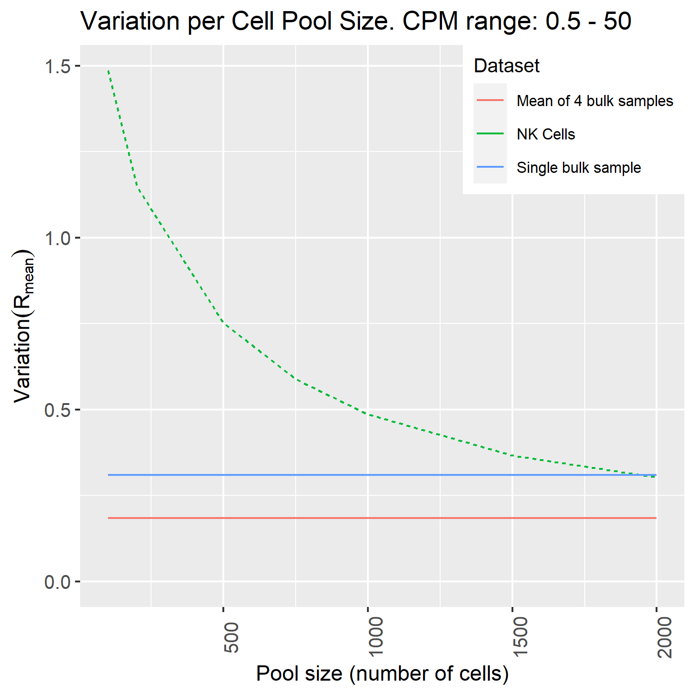

# GEM Extraction from single-cell RNA-Seq data

Single-cell RNA-Seq data is sparse, which means that samples (cells) contain much fewer mRNA molecules than what is normally the case for bulk RNA-Seq samples. It is therefore not recommended to generate context-specific models per individual cell - it is necessary to pool the transcriptomes of many cells gathered into a cell population to obtain a reliable gene expression profile. The typical use case is to generate context-specific models for cell types, where the transcriptomes of all cells classified as belonging to each type are pooled into a single cell type profile.

Generation of context-specific models from single-cell RNA-Seq data is further described in [Gustafsson _et al._ (2022) _PNAS_](http://dx.doi.org/10.1073/pnas.2217868120).

## Download the data

Single-cell RNA-Seq data come in many forms and there are many different technologies available to obtain such data. We will not go through these methods here, but assume that each cell population to examine is available in matrix form, where rows are genes and columns are cells. We recommend to use either R or python to assemble the single-cell data into such matrices, where for example the R package Seurat is suitable. We have extracted an NK cell population (10X Chromium data) from [Kim _et al._ (2020) _Nat. Commun._](https://www.nature.com/articles/s41467-020-16164-1), which is available as part of the downloadable files in [Zenodo](https://doi.org/10.5281/zenodo.6811073) associated with this guide.

## Estimation of the minimum cell population size for generation of stable models

The number of cells that needs to be pooled to generate stable models varies across cell types and datasets. To estimate the minimum number of cells required to generate a stable model we use the tool DSAVE described in [Gustafsson _et al._ (2020) _PLOS ONE_](https://journals.plos.org/plosone/article?id=10.1371/journal.pone.0243360). This can be installed using the following commands in R:

```R
# Install and load devtools:
install.packages("devtools")
library(devtools)
install_github("SysBioChalmers/DSAVE-R")
```

We then estimate the required number of cells:

```R
library(tidyverse)
library(ggplot2)
library(DSAVE)

setwd("my/path") #replace with your own path where the exported data was saved

scData = readRDS("NKPopForTutorial.rds")

#Run DSAVE and plot it
varNK = DSAVEGetTotalVariationPoolSize(scData, upperBound = 50, lowerBound = 5e-1)
fig = DSAVEPlotTotalVariation(varNK, c("NK Cells"), bulkIndex = 4)
fig

#export the figure to file
ggsave(
  "DSAVE.png",
  plot = fig,
  width = 5, height = 5, dpi = 300)
```

{: style="width:90%"}

We conclude that we need at least somewhere between 1,500 to 2,000 cells to get a similar variation as between bulk samples (the blue line) for this population.

!!! note
The DSAVE method can only test pool sizes up to half of the total population size. To investigate several populations in a dataset, it is therefore recommended to look at the large cell populations, check that the smaller ones have similar number of UMIs/counts per cell, and then use the larger cell population to estimate the minimum required number of cells for all populations.

## Pool the data

To pool the data into a profile, we simply add up the counts/UMIs from all cells in the population. We also convert the gene expression profile to counts per million (CPM) as a preparation for use with ftINIT.

```R
library(textTinyR)  # needed for rowSums to work with sparse matrices
genes = rownames(scData)
gexProfile = rowSums(scData)
toExport = tibble(genes = genes, NKCells = gexProfile)

# convert the data to CPM (counts per million, comparable to TPM)
toExport[[2]] = toExport[[2]]*10^6 / sum(toExport[[2]])

# always check that it worked
sum(toExport[[2]])  # 10^6
write_tsv(toExport, 'NKCells.txt')
```

The text file can then be imported to MATLAB followed by generation of a context-specific model by ftINIT in a similar way [that was shown for the GTEx data](gem_extraction.md). In this case, `prepHumanModelForftINIT` must be run with gene symbol conversion turned on (`prepHumanModelForftINIT(model, true, ...)`), since the genes in this table are in the gene symbols format. For other models than Human-GEM or animal models derived from that model, we recommend using the function `prepINITModel` instead of `prepHumanModelForftINIT`. Furthermore, we recommend to set the parameter skipScaling to true in such cases.

## Estimation of the uncertainty in generated models

To estimate the uncertainty in models generated from single-cell RNA-Seq data, it is possible to generate bootstraps (samples of cells) from the single-cell data. Bootstrapping is a method for generating samples with appropriate variation from the full population, and can be used to estimate the uncertainty in the model generation. How bootstraps can be used is demonstrated in [Gustafsson _et al._ (2022) _BioRXiv_](https://doi.org/10.1101/2022.04.25.489379).

```R
library(textTinyR)  # needed for rowSums to work with sparse matrices
set.seed(1)  # make reproducible
pooledBootstraps = Matrix(0, nrow = length(genes), ncol=100)
rownames(pooledBootstraps) = genes
for (j in 1:100) {
  # bootstrap,i.e. sample the same number of samples with replacement
  sel = sample(ncol(scData),ncol(scData), replace = TRUE)
  pooledBootstraps[, j] = rowSums(scData[, sel])
}
tibbBstr = as_tibble(pooledBootstraps) %>% add_column(gene = genes, .before = 1)
write_tsv(tibbBstr, "NKCell_bootstraps.txt")
```

Models are generated the same way from bootstrap samples as from other data. The variation in analysis results can then be examined across the bootstrap models. Examples of how such analysis can be performed can be found in the code associated with [Gustafsson _et al._ (2022) Generation of context-specific models from single-cell RNA-Seq data is further described in [Gustafsson _et al._ (2022) _PNAS_](http://dx.doi.org/10.1073/pnas.2217868120).
