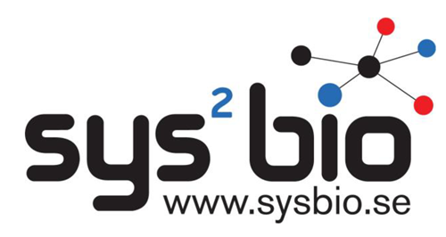

# Human-GEM User Guide

!!! important
    This guide applies to Human-GEM version [v1.6.0](https://github.com/SysBioChalmers/Human-GEM/releases/tag/v1.8.0). If you are using a different version of Human-GEM, we cannot guarantee that it will function as described in this guide.

## Overview

This guide contains instructions and examples of how to use [Human-GEM](https://github.com/SysBioChalmers/Human-GEM), a human genome-scale metabolic model (GEM). Choose a section from the sidebar or the list below to get started!

- [Installation](installation.md)
- [Getting started](getting_started.md)
- [Flux balance analysis](flux_balance_analysis.md)
- [GEM extraction using tINIT](gem_extraction.md)
- [GEM comparison](gem_comparison.md)
- [Additional tools](additional_tools.md)
- [FAQs and troubleshooting](faq_troubleshoot.md)
- [Contact](contact.md)

## Citation

> J. L. Robinson, et al. An atlas of human metabolism. _Sci. Signal._ 13, eaaz1482 (2020). [doi:10.1126/scisignal.aaz1482](https://doi.org/10.1126/scisignal.aaz1482)

  

[{: style="width:200px"}](https://www.sysbio.se/) &nbsp;&nbsp;&nbsp;&nbsp;&nbsp;&nbsp;&nbsp;&nbsp;&nbsp;&nbsp;
[{: style="width:200px"}](https://www.metabolicatlas.org/)

