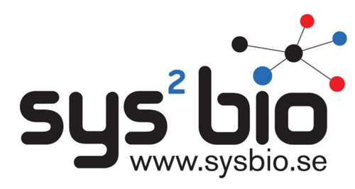

# Human-GEM User Guide

!!! important
    This guide applies to Human-GEM version [v2.0.0](https://github.com/SysBioChalmers/Human-GEM/releases/tag/v2.0.0) ("Human2"). If you are using a different version of Human-GEM, we cannot guarantee that it will function as described in this guide.

## Overview

This guide contains instructions and examples of how to use [Human-GEM](https://github.com/SysBioChalmers/Human-GEM), a human genome-scale metabolic model (GEM). Choose a section from the sidebar or the list below to get started!

- [Installation](installation.md)
- [Getting started](getting_started.md)
- [Flux balance analysis](flux_balance_analysis.md)
- [GEM extraction using ftINIT](gem_extraction.md)
- [GEM comparison](gem_comparison.md)
- [GEM extraction from single-cell RNA-Seq data](gem_extraction_sc.md)
- [Enzyme-constrained models](enzyme_constrained.md)
- [Gene essentiality with DepMap](gene_essentiality.md)
- [Whole-body models](whole_body_models.md)
- [Additional tools](additional_tools.md)
- [FAQs and troubleshooting](faq_troubleshoot.md)
- [Contact](contact.md)

## What's new in Human2

Human2 (v2.0.0) is a major update to Human-GEM, described in [Luo *et al.* (2026) *PNAS*](https://doi.org/10.1073/pnas.2516511123). Highlights include:

- **LLM-assisted curation.** Gene–reaction associations were systematically reviewed with large language models, improving gene–protein–reaction (GPR) rules and gene essentiality predictions. A public [metabolic-gene analysis GPT](https://chatgpt.com/g/g-HlJmY33es-metabolic-analysis-of-human-genes) is available.
- **Continuous quality control.** Every proposed change is checked by automated GitHub Actions (metabolic tasks, MEMOTE, MACAW, duplicate and dead-end detection) before it can be merged.
- **Improved annotation.** Expanded metabolite and reaction cross-references (including Rhea and MA identifiers) and structure-verified metabolite annotations at pH 7.3 (see [Additional tools](additional_tools.md)).
- **Enzyme-constrained and whole-body models.** An enzyme-constrained [ec-Human2](enzyme_constrained.md) and [whole-body models](whole_body_models.md) for different sexes and ages enable dynamic, multi-organ simulations.
- **Python support.** In addition to MATLAB, the workflows in this guide can now also be run from Python (COBRApy, `raven-toolbox`, and `geckopy`).

## Citation

If you use Human2 in your research, please cite:

> Luo J, Wang H, Moyer D, Guo Z, Robinson JL, Gustafsson J, Anton M, Chen Y, Kerkhoven EJ, Nielsen J, Li F. Reconstruction of human metabolic models with large language models. _PNAS_ 123.15:e2516511123 (2026). [doi:10.1073/pnas.2516511123](https://doi.org/10.1073/pnas.2516511123)

If you use Human1 in your research, please cite:

> Robinson JL, et al. An atlas of human metabolism. _Sci. Signal._ 13, eaaz1482 (2020). [doi:10.1126/scisignal.aaz1482](https://doi.org/10.1126/scisignal.aaz1482)

  

[{: style="width:200px"}](https://www.sysbio.se/) &nbsp;&nbsp;&nbsp;&nbsp;&nbsp;&nbsp;&nbsp;&nbsp;&nbsp;&nbsp;
[{: style="width:200px"}](https://www.metabolicatlas.org/)
